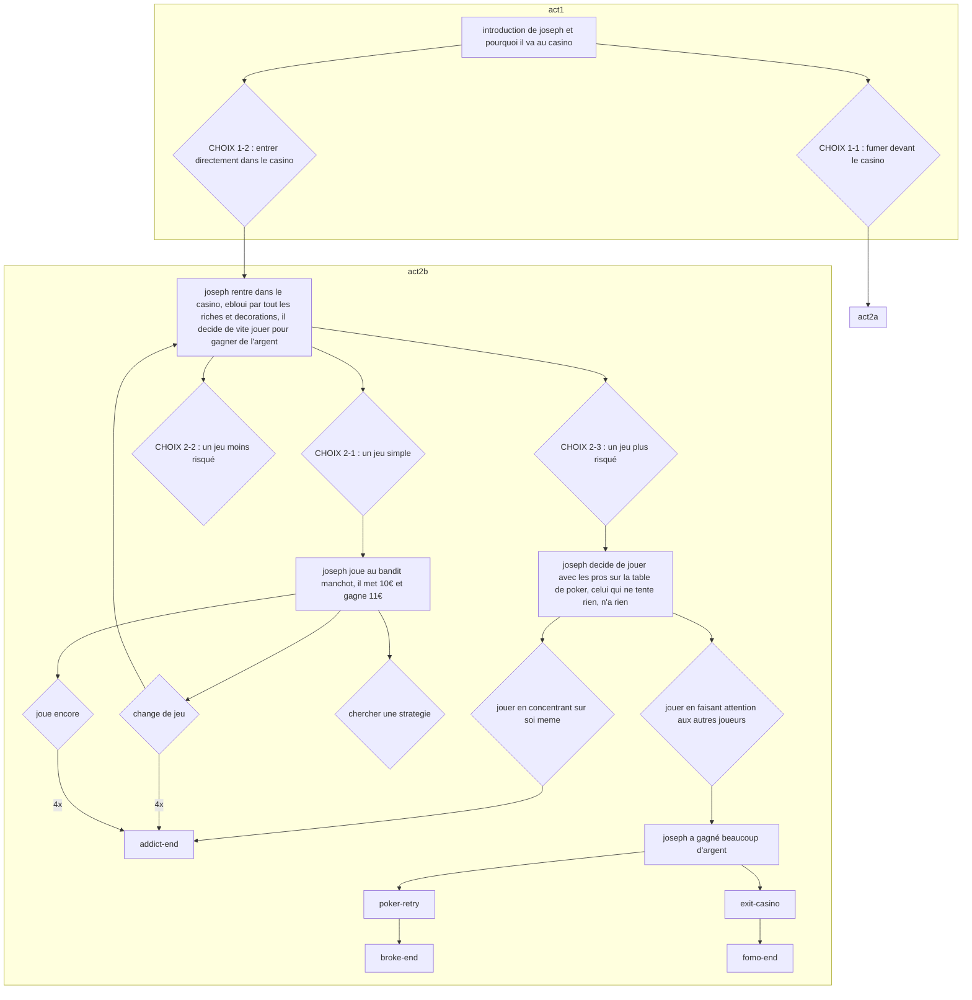

```mermaid
flowchart TB

subgraph act1
intro1[introduction de joseph et pourquoi il va au casino]

choix1-1{CHOIX 1-1 : fumer devant le casino}

choix1-2{CHOIX 1-2 : entrer directement dans le casino}

intro1 --> choix1-1
intro1 --> choix1-2
end

choix1-1 --> act2a
choix1-2 --> intro2

subgraph act2a

end

subgraph act2b

intro2[joseph rentre dans le casino, ebloui par tout les riches et decorations, il decide de vite jouer pour gagner de l'argent]

intro2 --> choix2-1
intro2 --> choix2-2
intro2 --> choix2-3

choix2-1{CHOIX 2-1 : un jeu simple}
choix2-2{CHOIX 2-2 : un jeu moins risqué}
choix2-3{CHOIX 2-3 : un jeu plus risqué}

choix2-1 --> bandit

bandit[joseph joue au bandit manchot, il met 10€ et gagne 11€]

bandit --> choix2-4
bandit --> choix2-5
bandit --> choix2-6

choix2-3 --> poker

poker[joseph decide de jouer avec les pros sur la table de poker, celui qui ne tente rien, n'a rien]

poker --> choix2-3-1
poker --> choix2-3-2

choix2-3-1{jouer en faisant attention aux autres joueurs}

choix2-3-2{jouer en concentrant sur soi meme}

choix2-3-2 --> addict-end

choix2-3-1 --> poker-win

poker-win[joseph a gagné beaucoup d'argent]

poker-win --> poker-retry
poker-win --> exit-casino

poker-retry --> broke-end

exit-casino --> fomo-end

choix2-4{joue encore}
choix2-5{change de jeu}
choix2-6{chercher une strategie}

choix2-5 --> intro2
choix2-5 --"4x"--> addict-end
choix2-4 --"4x"--> addict-end

end


```